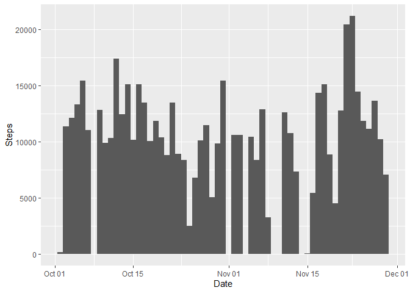
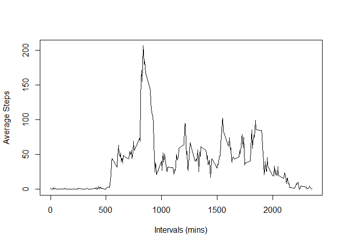
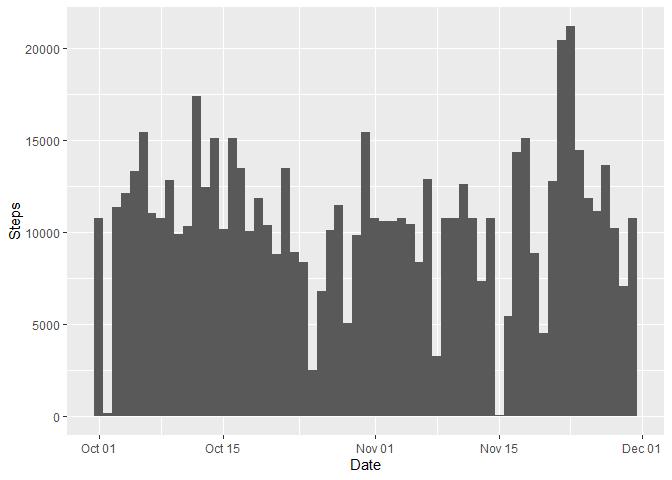
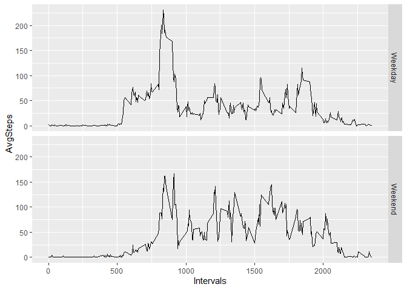

## Loading and preprocessing the data

```r
actdata <- read.csv(unz("activity.zip", "activity.csv"), colClasses =c("integer", "Date", "integer"))
```

## What is mean total number of steps taken per day?
Make a histogram of the total number of steps taken each day

```r
histdata<-na.omit(actdata)
suminfo<-aggregate(histdata$steps, by=list(histdata$date), sum)

names(suminfo)[1]<-"Date"
names(suminfo)[2]<-"Steps"
library(ggplot2)
ggplot(suminfo, aes(x=Date, y=Steps))+geom_bar(stat="identity", width=1)
```

<!-- -->

Calculate and report the mean and median total number of steps taken per day

```r
Meansteps<-mean(suminfo$Steps)
Midsteps<-median(suminfo$Steps)
```

The mean of the total number of steps taken per day is 10766.19, the median total number of steps taken per day is 10765.00

## What is the average daily activity pattern?
Make a time series plot (i.e. type = "l") of the 5-minute interval (x-axis) and the average number of steps taken, averaged across all days (y-axis)

```r
meaninfo<-aggregate(histdata$steps, by=list(histdata$interval), mean)
names(meaninfo)[1]<-"Intervals"
names(meaninfo)[2]<-"AvgSteps"
plot(meaninfo$Intervals, meaninfo$AvgSteps, type="l", xlab="Intervals (mins)", ylab="Average Steps")
```

<!-- -->

Which 5-minute interval, on average across all the days in the dataset, contains the maximum number of steps?

```r
maxsteps<-meaninfo[which.max(meaninfo$AvgSteps),]
```
At 835.00 interval, contains the maxium number of steps of 206.17.

## Imputing missing values
1. Calculate and report the total number of missing values in the dataset (i.e. the total number of rows with NAs)


```r
totalnas<-sum(is.na(actdata))
```
The total number of missing values in the dataset is 2304.00.

2. Devise a strategy for filling in all of the missing values in the dataset.
becaseu of the nature of the data, I feel the mean for the 5 min intervals should be reasonable to fill the missing values for steps. So which means the missing values will  be filled by condition: group by the intervals to get the mean value.

```r
library(dplyr)
filldata<-actdata%>%group_by(interval) %>%mutate(steps=replace(steps, is.na(steps), mean(steps, na.rm=TRUE)))
```

```r
fillsuminfo<-aggregate(filldata$steps, by=list(filldata$date), sum)

names(fillsuminfo)[1]<-"Date"
names(fillsuminfo)[2]<-"Steps"
library(ggplot2)
ggplot(fillsuminfo, aes(x=Date, y=Steps))+geom_bar(stat="identity", width=1)
```

<!-- -->

Calculate and report the mean and median total number of steps taken per day after the filling

```r
FillMeansteps<-mean(fillsuminfo$Steps)
FillMidsteps<-median(fillsuminfo$Steps)
```
The mean of the total number of steps taken per day after filling is 10766.19, the median total number of steps taken per day after filling is 10766.19. So by comparing, we see that mean is not affeccted at all, since we use mean to fill the missing value, but the medium value is changed to mean value now.


## Are there differences in activity patterns between weekdays and weekends?
1.Create a new factor variable in the dataset with two levels -- "weekday" and "weekend" indicating whether a given date is a weekday or weekend day.

```r
filldata$Weekday<-ifelse(weekdays(filldata$date) %in% c("Saturday","Sunday"),"Weekend", "Weekday") 
```

2.Make a panel plot containing a time series plot (i.e. type = "l") of the 5-minute interval (x-axis) and the average number of steps taken, averaged across all weekday days or weekend days (y-axis). 


```r
fillplot<-aggregate(filldata$steps, by=list(filldata$interval, filldata$Weekday), mean)
names(fillplot)[1]<-"Intervals"
names(fillplot)[2]<-"Weekday"
names(fillplot)[3]<-"AvgSteps"
ggplot(fillplot, aes(x=Intervals, y=AvgSteps))+geom_line(stat="identity", width=1)+facet_wrap(~Weekday)+facet_grid(Weekday~.)
```

<!-- -->
